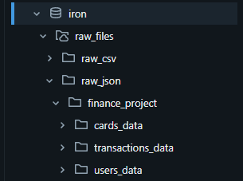
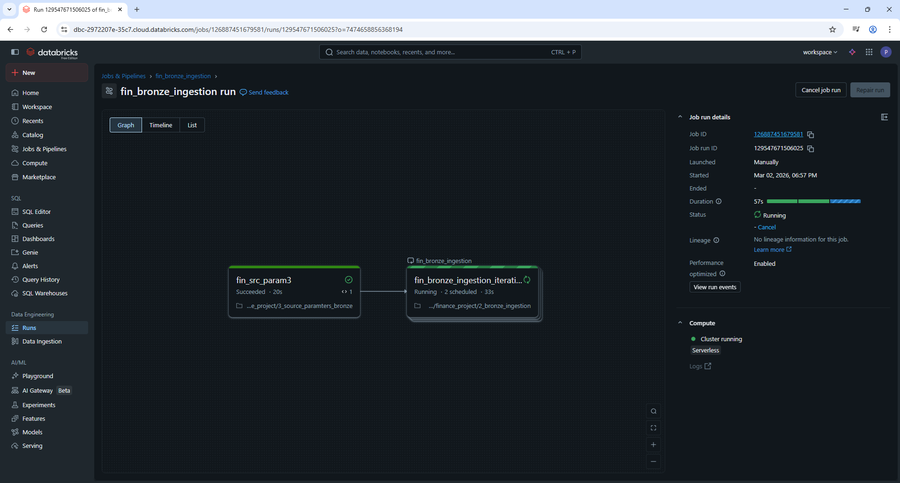
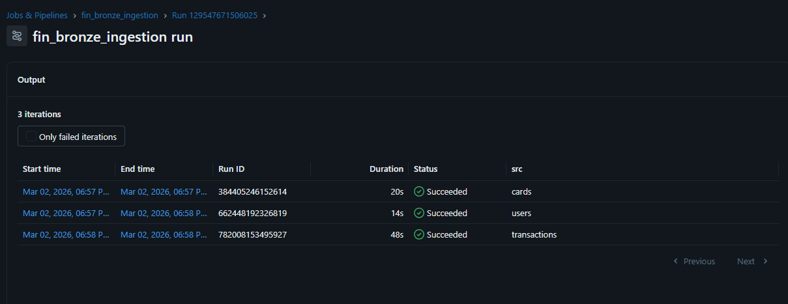
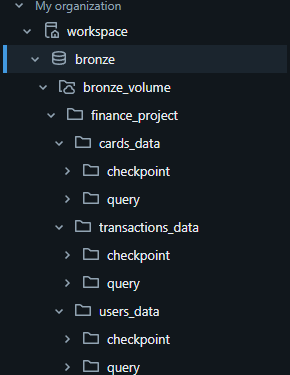
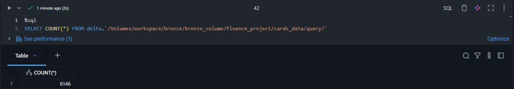
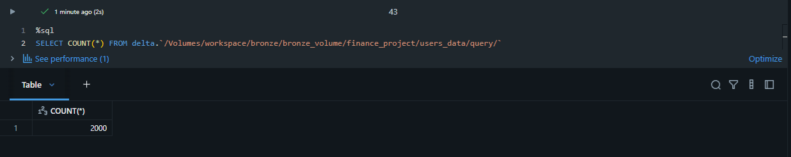
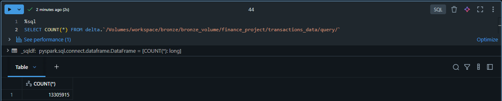
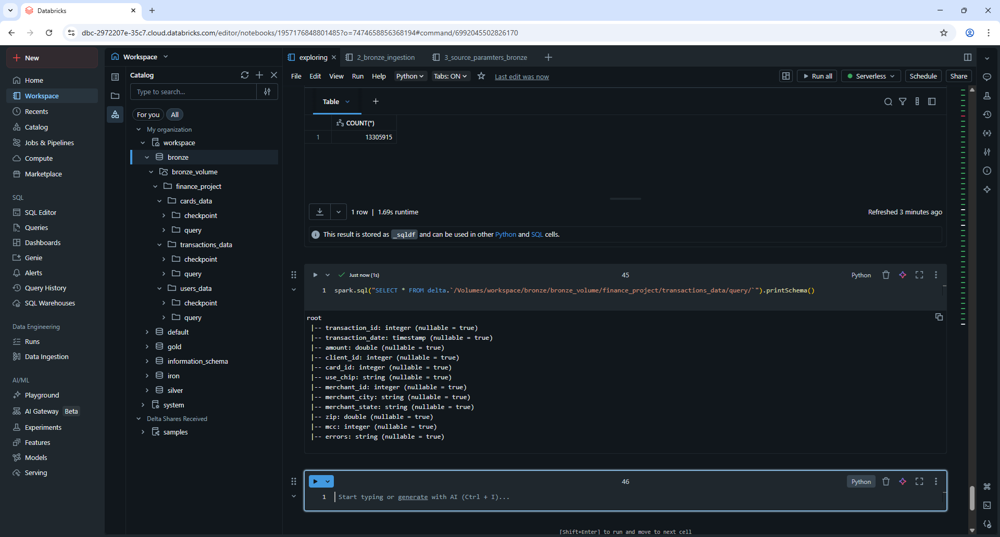

# Bronze layer | Data ingestion

### Table of Contents
1. [Introduction](#1-introduction)  
2. [Code](#2-code)  
3. [Idempotent Ingestion](#3-idempotent-ingestion)  
4. [Schema Enforcement](#4-schema-enforcement)  
5. [Flattening and data type normalization](#5-flattening-and-data-type-normalization)  
6. [Why Delta format?](#6-why-delta-format?)  
7. [Job Automation](#7-job-automation)  
8. [Job Test](#8-job-test)  

### 1. Introduction
This section presents the first two layers of the medallion architecture implemented in this project: the Iron (raw) layer and the Bronze layer.  
The Iron layer is the landing zone where raw data is stored in its original format, without any transformation. For this project, I chose to work with JSON files in the banking domain, structured according to a star schema design. The dataset consists of one fact table, transactions_data, containing approximately 13 million rows, and multiple dimension tables.  
The reason transactions_data is considered the fact table is because it represents real historical business events, financial transactions. Each row captures a measurable event, which can be analyzed across different dimensions such as customers, cards, and merchants.  
An important characteristic of this dataset is that the transactions JSON file contains embedded merchant information inside each transaction record. This nested structure effectively contains dimensional data within the fact file. In later layers, this merchant information is extracted and materialized into a separate dimension table to properly align with star schema principles.

In addition to the transactions dataset, two other JSON sources provide dimension data:

- users_data (customer dimension)
- cards_data (card dimension)

At this stage, the raw catalog structure in the Iron layer is organized as follows:



### 2. Code

```python
# Dependencies and variables
dbutils.widgets.text("src", "")
src = dbutils.widgets.get("src")
from pyspark.sql.functions import *
from pyspark.sql.types import *

# Paths:
input_path = f"/Volumes/workspace/iron/raw_files/raw_json/finance_project/{src}_data/"
checkpoint = f"/Volumes/workspace/bronze/bronze_volume/finance_project/{src}_data/checkpoint"
delta_path = f"/Volumes/workspace/bronze/bronze_volume/finance_project/{src}_data/query"

# Declaring Schemas
users_schema = StructType([
    StructField("customer", StructType([
        StructField("id", StringType(), True),
        StructField("personal", StructType([
            StructField("address", StringType(), True),
            StructField("birth_month", StringType(), True),
            StructField("birth_year", StringType(), True),
            StructField("gender", StringType(), True),
            StructField("current_age", StringType(), True),
            StructField("retirement_age", StringType(), True)
        ]), True),
        StructField("financial", StructType([
            StructField("credit_score", StringType(), True),
            StructField("num_credit_cards", StringType(), True),
            StructField("total_debt", StringType(), True),
            StructField("yearly_income", StringType(), True),
            StructField("per_capita_income", StringType(), True)
        ]), True),
        StructField("location", StructType([
            StructField("latitude", StringType(), True),
            StructField("longitude", StringType(), True)
        ]), True)
    ]), True)
])

cards_schema = StructType([
    StructField("card", StructType([
        StructField("id", StringType(), True),
        StructField("client_id", StringType(), True),
        StructField("details", StructType([
            StructField("card_brand", StringType(), True),
            StructField("card_type", StringType(), True),
            StructField("card_number", StringType(), True),
            StructField("expires", StringType(), True),
            StructField("cvv", StringType(), True),
            StructField("has_chip", StringType(), True)
        ]), True),
        StructField("history", StructType([
            StructField("num_cards_issued", StringType(), True),
            StructField("credit_limit", StringType(), True),
            StructField("acct_open_date", StringType(), True),
            StructField("year_pin_last_changed", StringType(), True)
        ]), True),
        StructField("security", StructType([
            StructField("card_on_dark_web", StringType(), True)
        ]), True)
    ]), True)
])

transactions_schema = StructType([
    StructField("transaction", StructType([
        StructField("id", StringType(), True),
        StructField("date", StringType(), True),
        StructField("amount", StringType(), True),
        StructField("client", StructType([
            StructField("client_id", StringType(), True),
            StructField("card_id", StringType(), True),
            StructField("use_chip", StringType(), True)
        ]), True),
        StructField("merchant", StructType([
            StructField("merchant_id", StringType(), True),
            StructField("city", StringType(), True),
            StructField("state", StringType(), True),
            StructField("zip", StringType(), True),
            StructField("mcc", StringType(), True)
        ]), True),
        StructField("errors", StringType(), True)  # guaranteed column
    ]), True)
])

# Map source to schema
schema_map = {
    "users": users_schema,
    "cards": cards_schema,
    "transactions": transactions_schema
}
df_stream = (spark.readStream
    .format("cloudFiles")
    .option("cloudFiles.format", "json")
    .schema(schema_map[src])
    .option("cloudFiles.schemaLocation", checkpoint)  # same checkpoint
    .option("multiline", True)
    .load(input_path))

# Flattening and casting columns
if src == "users":
    df_flattened = df_stream.select(
        col("customer.id").cast(IntegerType()).alias("customer_id"),
        col("customer.personal.address").alias("address"),
        col("customer.personal.birth_month").alias("birth_month"),
        col("customer.personal.birth_year").cast(IntegerType()).alias("birth_year"),
        col("customer.personal.gender").alias("gender"),
        col("customer.personal.current_age").cast(IntegerType()).alias("current_age"),
        col("customer.personal.retirement_age").cast(IntegerType()).alias("retirement_age"),
        col("customer.financial.credit_score").cast(IntegerType()).alias("credit_score"),
        col("customer.financial.num_credit_cards").cast(IntegerType()).alias("num_credit_cards"),
        regexp_replace(col("customer.financial.total_debt").cast("string"), "[$,]", "").cast(DoubleType()).alias("total_debt"),
        regexp_replace(col("customer.financial.yearly_income").cast("string"), "[$,]", "").cast(DoubleType()).alias("yearly_income"),
        regexp_replace(col("customer.financial.per_capita_income").cast("string"), "[$,]", "").cast(DoubleType()).alias("per_capita_income"),
        regexp_replace(col("customer.location.latitude").cast("string"), "[$,]", "").cast(DoubleType()).alias("latitude"),
        regexp_replace(col("customer.location.longitude").cast("string"), "[$,]", "").cast(DoubleType()).alias("longitude")
    )

elif src == "cards":
    df_flattened = df_stream.select(
        col("card.id").cast(IntegerType()).alias("card_id"),
        col("card.client_id").cast(IntegerType()).alias("client_id"),
        col("card.details.card_brand").alias("card_brand"),
        col("card.details.card_type").alias("card_type"),
        col("card.details.card_number").cast(LongType()).alias("card_number"),
        col("card.details.expires").alias("expires"),
        col("card.details.cvv").cast(IntegerType()).alias("cvv"),
        col("card.details.has_chip").cast(BooleanType()).alias("has_chip"),
        col("card.history.num_cards_issued").cast(IntegerType()).alias("num_cards_issued"),
        regexp_replace(col("card.history.credit_limit").cast("string"), "[$,%]", "").cast(DoubleType()).alias("credit_limit"),
        col("card.history.acct_open_date").alias("acct_open_date"),
        col("card.history.year_pin_last_changed").cast(IntegerType()).alias("year_pin_last_changed"),
        col("card.security.card_on_dark_web").cast(BooleanType()).alias("card_on_dark_web")
    )

elif src == "transactions":
    df_flattened = df_stream.select(
        col("transaction.id").cast(IntegerType()).alias("transaction_id"),
        col("transaction.date").cast(TimestampType()).alias("transaction_date"),
        regexp_replace(col("transaction.amount"), "[$,]", "").cast(DoubleType()).alias("amount"),
        col("transaction.client.client_id").cast(IntegerType()).alias("client_id"),
        col("transaction.client.card_id").cast(IntegerType()).alias("card_id"),
        col("transaction.client.use_chip").alias("use_chip"),
        col("transaction.merchant.merchant_id").cast(IntegerType()).alias("merchant_id"),
        col("transaction.merchant.city").alias("merchant_city"),
        col("transaction.merchant.state").alias("merchant_state"),
        col("transaction.merchant.zip").cast(DoubleType()).alias("zip"),
        col("transaction.merchant.mcc").cast(IntegerType()).alias("mcc"),
        col("transaction.errors").alias("errors")  
    )

# Writing it to bronze layer
df_flattened.writeStream.format("delta")\
    .outputMode("append")\
    .trigger(availableNow=True)\
    .option("checkpointLocation", checkpoint)\
    .option("path", delta_path)\
    .start()
```

To ingest data from the Iron layer into the Bronze layer, I scheduled a Databricks job that incrementally processes all tables. The ingestion is automated and parameterized using dbutils.widgets, allowing the same notebook to process multiple sources dynamically.
Because I am using the Databricks Community Edition, I configured the streaming trigger as:
```python
.trigger(availableNow=True)
```
In an Enterprise environment, this would typically be replaced with:
```python
.trigger(processingTime="1 minute")
```
or a continuous trigger, depending on the production requirement.    
The availableNow=True trigger processes all available data in a microbatch and then stops. This is ideal for incremental batch ingestion while still leveraging structured streaming and autoloader.

### 3. Idempotent Ingestion
A key design decision in this layer is idempotency.
Using Auto Loader (cloudFiles) with a checkpoint location ensures that files that are already processed are tracked, therefore in future runs those files are skipped and only new files are processed in subsequent runs. This prevents duplicate ingestion at the file level.However, this does not eliminate potential duplicate records within a single file or batch. At this stage, no explicit row level deduplication logic is implemented, as the primary goal here is controlled ingestion and keeping the structure as original as possible rather than enforcing onstraints.

### 4. Schema Enforcement
Schemas are explicitly declared for each dataset (users_schema, cards_schema, transactions_schema) and mapped dynamically using:
```python
schema_map = {
    "users": users_schema,
    "cards": cards_schema,
    "transactions": transactions_schema
}
```
This prevents schema inference overhead and ensures consistent typing across runs. Explicit schema enforcement also protects against unexpected structural drift in incoming JSON files.

### 5. Flattening and data type normalization
The raw JSON files contain nested structures. During ingestion into Bronze, I flatten these structures and normalize column names and data types.
For example nested fields such as transaction.client.client_id are flattened, currency-formatted strings are cleaned using regexp_replace, numeric fields are cast to IntegerType, DoubleType, or BooleanType. Casting primary keys as IntegerType is very important because I query the data after each incremental load and confirm new data arrival usually using SELECT * FROM delta.`path` order by primary_key DESC LIMIT 200. Usually helps me confirm new batch arrived so i could debug the issues as early as possible before the problem reaches downstream layers and potentially cause and mix with other errors.
Some transformations such as converting "MM/YY" formatted expiration dates are intentionally postponed to the silver layer. This decision balances computational cost and architectural responsibility because as I stated previously, bronze layer mainly for structural normalization and light cleansing and on silver layer I will be performing more tranformations using delta live tables.
It might sound contradicting since I used operations like regexp_replace on large columns (expire_date 13 million transaction rows). Although performing regexp_replace on large columns such as transaction amounts introduces additional computational overhead at the Bronze stage, it was intentionally implemented to highlight a common architectural tradeoff in medallion design. While Bronze layers ideally remain minimally transformed, early type normalization can prevent distribution of irregular values downstream. In production systems, this decision would depend on workload size, SLA requirements, and cluster configuration, and might instead be deferred to the Silver layer to optimize cost efficiency.

### 6. Why Delta format?
I think the answer is very clear for this day and age. Delta Lake has effectively become the industry standard for building reliable lakehouse architectures, especially within the Databricks ecosystem. The decision to use Delta was not incidental; it was driven by the need for reliability and structural control in an incremental ingestion pipeline handling millions of records, ensuring that streaming writes are completed safely without partial commits or data corruption. It also enforces schemas at write time, preventing accidental schema drift from mutated JSON files while still allowing controlled schema evolution when needed. Also. the transaction log (_delta_log) maintains a complete versioned history of all operations, enabling auditing, reproducibility, and time travel queries to previous table states, a critical capability when working with financial transaction data.

### 7. Job automation
Databricks allows me to create a job where this notebook gets depended by another notebook where i declare the source array and dbutils.jobs.taskValues.get like below:
```python
src_array = [
    {"src" : "cards"},
    {"src" : "users"},
    {"src" : "transactions"}
]
dbutils.jobs.taskValues.set(key = "output_key", value = src_array)
```

### 8. Job test
Below is a picture of the job running:


The pipeline ran succesfully:


I will confirm that the delta tables have been created by checking the catalog.



So far everything looks good, each table, dimension and fact have their own seperate checkpoint location and delta logs

I will query each delta table and confirm the ingestion job worked fine.



