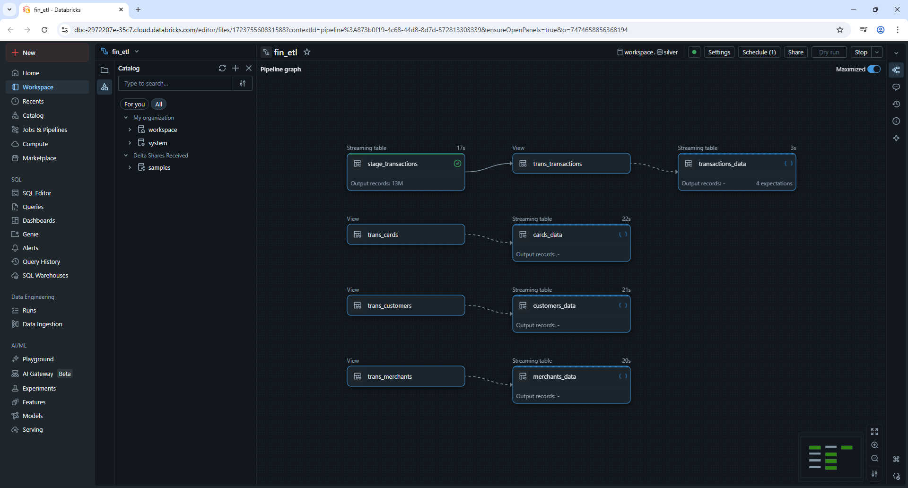
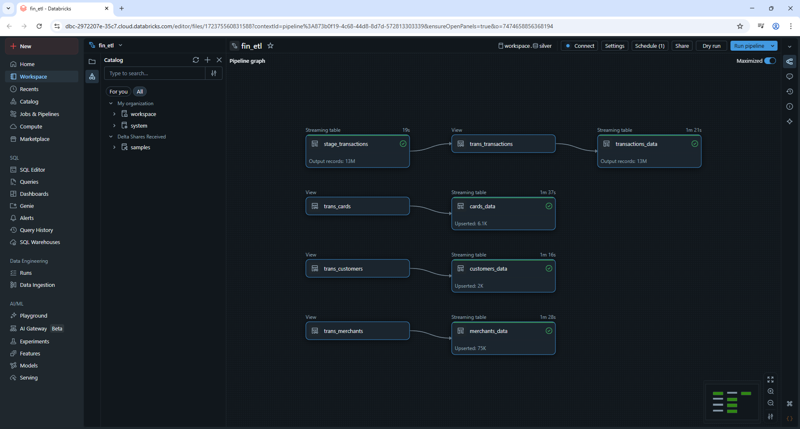
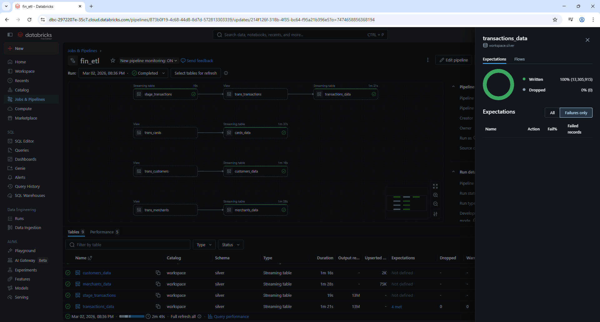
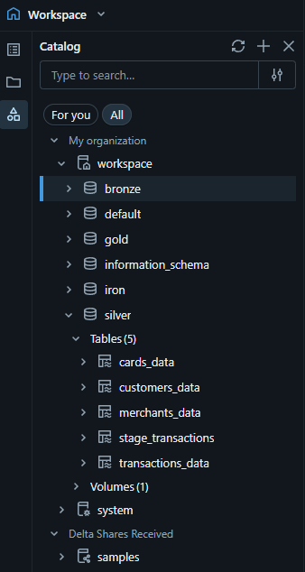

# Silver Layer | Data Refinement & Dimensional Modeling

## Table of Contents
1. [Introduction](#1-introduction)  
2. [Fact Table (transactions_data)](#2-fact-table-(transactions_data))  
3. [Dimension Tables](#3-dimension-tables)  
4. [Architectural Outcome](#4-architectural-outcome)  
5. [Pipeline test](#5-pipeline-test)  

### 1. Introduction
The silver layer is implemented using Delta Live Tables within the Databricks environment. While the bronze layer was responsible for incremental ingestion and structural normalization, the silver layer introduces business level transformations, data quality enforcement, deduplication logic, and dimensional modeling alignment. All transformations are built on top of Delta Lake tables created in the Bronze layer. By leveraging Delta Live Tables (DLT), the pipeline becomes declarative, continuously validated, and automatically managed with built in expectations(rules) and change data capture (CDC) handling. This layer will be represented by a single python script which will serve as my ETL pipeline for all tables, fact table included.

Primary objectives in this python script will be:
- Enforcing constraints
- Eliminating duplicate records
- Applying the proper transformations
- Implementing Slowly Changing Dimensions (SCD Type 1) to insert new records and replace old ones with the updated versions

The ETL pipeline


### 2. Fact Table (transactions_data)
```python
import dlt
from pyspark.sql.functions import *
from pyspark.sql.types import *

################### The fact table

@dlt.table(
    name = "stage_transactions"
)

def stage_transactions():
    df = spark.readStream.format("delta")\
        .load("/Volumes/workspace/bronze/bronze_volume/finance_project/transactions_data/query/")
    return df

@dlt.view(
    name = "trans_transactions"
)

def trans_transactions():
    df = spark.readStream.table("stage_transactions")
    df = df.withColumn("modifiedDate", current_timestamp())\
        .withColumnRenamed("client_id", "customer_id")\
        .drop("merchant_city", "merchant_state", "zip", "mcc" , "errors")
    return df

rules = {
    "rule_1" : "transaction_id IS NOT NULL",
    "rule_2" : "customer_id IS NOT NULL",
    "rule_3" : "card_id IS NOT NULL",
    "rule_4" : "merchant_id IS NOT NULL"
}

@dlt.table (
    name = "transactions_data"
)
@dlt.expect_all_or_drop(rules)
def transactions_data():
    df = spark.readStream.table("trans_transactions")
    return df
```

- Staging Layer (stage_transactions) streams directly from the bronze delta table and acts as a raw silver entry point without transformations.
- Transformation Layer (trans_transactions) renames client_id to customer_id to align with users_data table for downstream joins, removes merchant descriptive columns (which will be modeled separately as a dimension), drops unnecessary attributes such as errors, adds a modifiedDate column for traceability, removes duplicate records based on transaction_id.
- Quality Enforcement & Final Table (transactions_data): Using @dlt.expect_all_or_drop, strict non-null constraints are enforced for ("transaction_id", "customer_id", "card_id", "merchant_id"). Records failing these constraints are automatically dropped.

### 3. Dimension Tables
Dimension tables are built using streaming tables combined with automatic CDC flows. Each dimension streams from its respective bronze source, applies cleansing and standardization, removes duplicates, uses dlt.create_auto_cdc_flow and finally implements SCD Type 1 logic. The reason why SCD1 will be implemented on dimension tables only and not on the fact table is because dimension tables are the ones that change their dimensions, a record gets changed and updated over time and that record when the time is due with be overwritten on the silver layer, however it will not be entirely lost since on the gold layer the data will be preserved using SCD2. Usually fact tables are append mode only, and keep adding new records, history does not change, it simply grows, even in cases of refunds or other scenarios.

```python
##################### dim tables - merchants_data

@dlt.view (
    name = "trans_merchants"
    )

@dlt.expect_all_or_drop({"merchant_id": "merchant_id IS NOT NULL"})

def trans_merchants():
    df = spark.readStream.format("delta")\
        .load("/Volumes/workspace/bronze/bronze_volume/finance_project/transactions_data/query/")

    df = df.select("merchant_id", "merchant_city", "merchant_state", "zip", "mcc")
            .withColumn("modifiedDate", current_timestamp())
    return df

dlt.create_streaming_table("merchants_data")
dlt.create_auto_cdc_flow (
    target = "merchants_data",
    source = "trans_merchants",
    keys = ["merchant_id"],
    sequence_by = col("modifiedDate"),
    stored_as_scd_type = 1
)

################################# cards_data

@dlt.view (
    name = "trans_cards"
)

@dlt.expect_all_or_drop({"card_id": "card_id IS NOT NULL"})

def trans_cards():
    df = spark.readStream.format("delta")\
        .load("/Volumes/workspace/bronze/bronze_volume/finance_project/cards_data/query/")
    df = df.withColumn("expires", to_date(concat_ws("-", split(col("expires"), "/").getItem(1), split(col("expires"), "/").getItem(0), lit("01"))))\
            .withColumn("acct_open_date", to_date(concat_ws("-", split(col("acct_open_date"), "/").getItem(1), split(col("acct_open_date"), "/").getItem(0), lit("01"))))\
            .withColumn("modifiedDate", current_timestamp())
            
    return df
dlt.create_streaming_table("cards_data")
dlt.create_auto_cdc_flow (
    target = "cards_data",
    source = "trans_cards",
    keys = ["card_id"],
    sequence_by = col("modifiedDate"),
    stored_as_scd_type = 1
)

################################# users_data

@dlt.view (
    name = "trans_customers"
)

@dlt.expect_all_or_drop({"customer_id" : "customer_id IS NOT NULL"})

def trans_customers():
    
    df = spark.readStream.format("delta")\
        .load("/Volumes/workspace/bronze/bronze_volume/finance_project/users_data/query/")
    df = df.withColumn("modifiedDate", current_timestamp())
    return df
dlt.create_streaming_table("customers_data")
dlt.create_auto_cdc_flow(
    target = "customers_data",
    source = "trans_customers",
    keys = ["customer_id"],
    sequence_by = col("modifiedDate"),
    stored_as_scd_type = 1
)
```

### 4. Architectural Outcome
By combining streaming reads from bronze, declarative DLT expectations and letting databricks take care of everything that goes under the hood, automatic CDC flows, SCD Type 1 handling, Delta Lake transactional guarantees, the Silver layer transforms structurally clean data into validated, dimensionally modeled tables.

### 5. Pipeline test
Pipeline ran successfully.



None of the rules were broken and no drops happened in this batch.



In the silver schema 5 materialized tables and 4 materialized views have been created.

