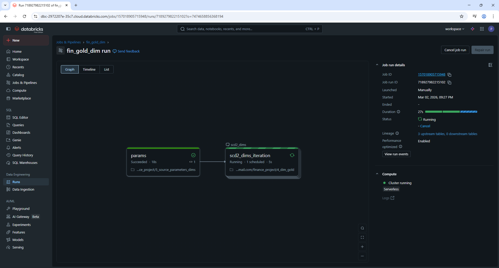
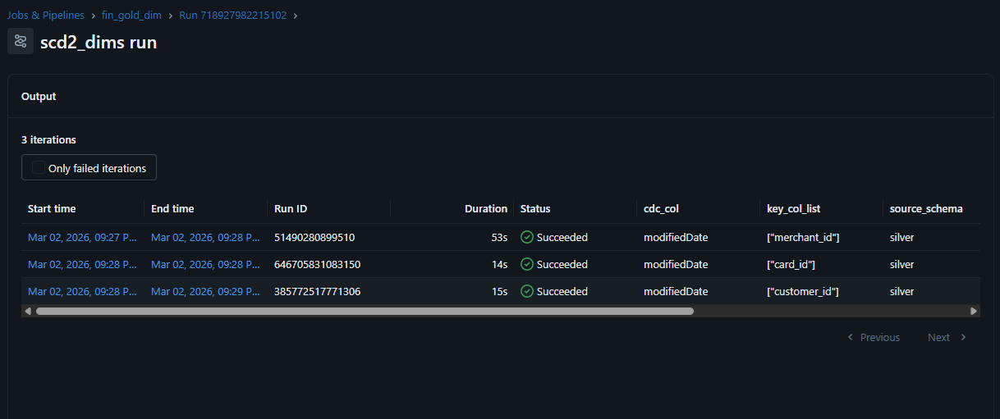
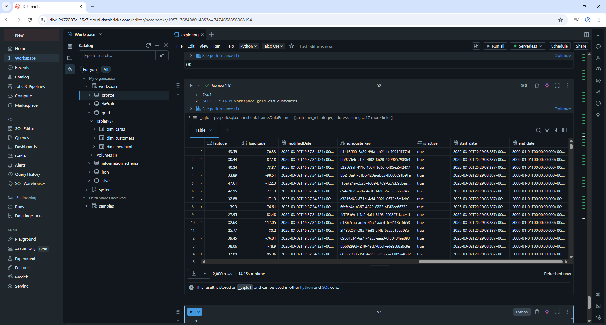

# Gold Layer | SCD Type 2 Delta Lake Pipeline | Dimensions

## Table of Contents
1. [Introduction](#1-introduction)  
2. [Dependencies](#2-dependencies)  
3. [Dynamic Variables](#3-dynamic-variables)  
4. [Initial Table Creation (First Load)](#4-initial-table-creation-(first-load))  
5. [Update Logic (SCD2 Merge Process)](#5-update-logic-(SCD2-Merge-Process))  
6. [Merge condition](#6-merge-condition)  
7. [Update target table](#7-update-target-table)  
8. [Inserting new & updated records](#8-inserting-new-&-updated-records)  
9. [Dimension Configuration for Automated Execution](#9-dimension-configuration-for-automated-execution)
10. [Job test](#10-Job-test)
### 1. Introduction
This section implements a Slowly Changing Dimension Type 2 (SCD2) pattern using Apache Spark and Delta Lake. The goal of the pipeline is to maintain historical records of dimension data by expiring outdated records and inserting new versions whenever a change is detected in the source dataset.



### 2. Dependencies
```python
from pyspark.sql.functions import *
from pyspark.sql.window import Window
from pyspark.sql.types import *
from delta.tables import DeltaTable
```
This block imports the necessary PySpark and Delta Lake dependencies required for the pipeline. 
### 3. Dynamic Variables
```python
dbutils.widgets.text("source_schema", "")
dbutils.widgets.text("source_obj", "")
dbutils.widgets.text("target_schema", "")
dbutils.widgets.text("target_obj", "")
dbutils.widgets.text("cdc_col", "")
dbutils.widgets.text("key_col_list", "")
```
This cell defines Databricks widgets that allow the notebook to receive parameters dynamically. These widgets make the pipeline reusable because the same notebook can run for multiple tables without modifying the code. By passing different schemas, table names, and key columns, the notebook can be executed for different dimension pipelines within a larger orchestration workflow.
```python
source_schema = dbutils.widgets.get("source_schema")
source_obj = dbutils.widgets.get("source_obj")
target_schema = dbutils.widgets.get("target_schema")
target_obj = dbutils.widgets.get("target_obj")
cdc_col = dbutils.widgets.get("cdc_col")
key_col_list = eval(dbutils.widgets.get("key_col_list"))
```
After defining the widgets, their values are retrieved and stored in Python variables. These variables will be used throughout the notebook to dynamically reference the correct source and target tables. The key_col_list parameter is converted from a string into a Python list using eval() because the widget input is passed as a string representation of a list. Although in this project, every dimension table will have only one column inside it, I still kept it like this just in case a dimension table in the future will require more than one column.
```python
source_table = f"{source_schema}.{source_obj}"
target_table = f"{target_schema}.{target_obj}"
df_source = spark.table(source_table)
```
This cell constructs the fully qualified table names for the source and target datasets. By combining the schema and table names dynamically, the pipeline ensures that it can be reused for multiple environments or data domains without requiring manual changes to the code. At this stage, the pipeline reads the source table from the metastore into a Spark DataFrame. The source table represents the most recent snapshot of the dimension data and acts as the input for the SCD Type 2 transformation process. All change detection logic will be performed by comparing this dataset with the existing records in the target dimension table.

### 4. Initial Table Creation (First Load)
```python
if not spark.catalog.tableExists(target_table):
```
Before performing any merge operations, the pipeline checks whether the target dimension table already exists in the catalog. If the table does not exist, the pipeline performs an initial load that creates the dimension table and inserts the first version of all records from the source dataset. In our case, for our first batch that we are loading, this block will be ran and the rest will be skipped. In order to check how the else block performs when the autoloader loads the second batch [check here](../../Second%20Batch/README.md#gold-layer--dimension-tables).
```python
df_init = (df_source
        .withColumn("surrogate_key", expr("uuid()"))
        .withColumn("is_active", lit(True))
        .withColumn("start_date", current_timestamp())
        .withColumn("end_date", to_timestamp(lit("3000-01-01")))
)

df_init.write.format("delta")\
        .mode("overwrite")\
        .saveAsTable(target_table)
```
During the initial load, several additional columns are added to support SCD Type 2 functionality. A surrogate key is generated using a UUID to uniquely identify each version of a record independently from the business keys. The is_active column indicates whether the record represents the current version. The start_date records the moment the row becomes valid, while the end_date is initially set to a far future timestamp to represent an open-ended active record. Once the initial dataset is prepared, it is written to the target location as a Delta table. Delta Lake provides transactional guarantees, schema enforcement, and support for merge operations, making it well suited for implementing historical dimension tables.

### 5. Update Logic (SCD2 Merge Process)
```python
target_delta = DeltaTable.forName(spark, target_table)

df_source_prepared = (df_source
        .withColumn("surrogate_key", expr("uuid()"))
        .withColumn("is_active", lit(True))
        .withColumn("start_date", current_timestamp())
        .withColumn("end_date", to_timestamp(lit("3000-01-01")))
)
```
If the target table already exists, the pipeline loads it as a DeltaTable object. This allows the notebook to perform merge operations directly against the table, which is necessary for updating existing records and inserting new ones according to the SCD Type 2 pattern.
The source dataset is enriched with the same SCD tracking columns that exist in the target table. These columns will be used when inserting new versions of records after detecting changes in the source data.
### 6. Merge condition
```python
join_condition = " AND ".join([f"t.{c} = s.{c}" for c in key_col_list])

exclude_cols = set(key_col_list + 
                   [cdc_col, "surrogate_key", "is_active", "start_date", "end_date"])

compare_cols = [c for c in df_source_prepared.columns if c not in exclude_cols]

change_condition = " OR ".join([f"t.{c} IS DISTINCT FROM s.{c}" for c in compare_cols])

final_condition = f"t.is_active = true AND s.{cdc_col} > t.{cdc_col} AND ({change_condition})"
```
This step dynamically constructs the join condition used during the merge operation. The join is performed using the business key columns that uniquely identify records in the dimension table. By building the condition programmatically, the pipeline remains flexible and can support dimension tables with different key structures.  
Not all columns should trigger a new dimension version. This step identifies columns that must be excluded from change detection. These include the business keys, the CDC column used for ordering changes, and the internal SCD tracking columns. Excluding these ensures that only meaningful attribute changes generate a new record version.  
After defining the excluded columns, the pipeline determines which columns should actually be compared between the source and target datasets. These columns represent the attributes of the dimension that may change over time.  
A change detection condition is constructed by comparing each attribute column between the source and the existing target record. If any attribute value differs, the pipeline interprets this as a dimension change that requires expiring the previous version and inserting a new one.  
The final condition ensures that updates are applied only when necessary. A row will be expired if it is currently active, if the incoming CDC timestamp is newer than the existing record, and if at least one attribute column has changed. This prevents unnecessary updates and preserves correct historical ordering.  
### 7. Update target table
```python
target_delta.alias("t").merge(
    df_source_prepared.alias("s"),
    join_condition
).whenMatchedUpdate(
    condition = final_condition,
    set = {
        "is_active" : "false",
        "end_date" : "current_timestamp()"
    }
).execute()
```
The merge operation aligns source and target records based on their business keys. Delta Lake uses this merge operation to efficiently determine which records require updates and which should remain unchanged.  
When the change detection condition is satisfied, the existing active record is expired by setting the is_active flag to false and updating the end_date to the current timestamp. This marks the end of the validity period for the previous version of the record.
### 8. Inserting new & updated records
```python
df_insert = df_source_prepared.alias("s").join(
target_delta.toDF().alias("t"),
    expr(join_condition),
    how = "left_outer"
).filter(
    (col("t.surrogate_key").isNull())
).select("s.*")

```
After expiring outdated records, the pipeline identifies rows that should be inserted as new versions. This join compares the prepared source dataset with the target table to determine which records are either completely new or represent updated versions of existing records.    
The filtering logic ensures that only records requiring insertion are selected. This includes entirely new records that do not yet exist in the dimension table as well as records whose previous version was just expired due to a detected change.    
Only the prepared source columns are selected for insertion, ensuring that the new version of the record includes all attributes and the necessary SCD tracking metadata.  
```python
df_insert.write.format("delta")\
    .mode("append")\
    .option("mergeSchema", "true")
    .saveAsTable(target_table)

print("SCD2 completed")
```
The new records are appended to the Delta table, creating a new historical version for each changed or newly introduced dimension record.  
### 9. Dimension table configuration for automated execution
```python
dim_array= [
    {
        "source_schema" : "silver",
        "source_obj" : "merchants_data",
        "target_schema" : "gold",
        "target_obj" : "dim_merchants",
        "cdc_col" : "modifiedDate",
        "key_col_list" : ["merchant_id"]
        },
    
    {
        "source_schema" : "silver",
        "source_obj" : "cards_data",
        "target_schema" : "gold",
        "target_obj" : "dim_cards",
        "cdc_col" : "modifiedDate",
        "key_col_list" : ["card_id"]  
    }, 

    {
        "source_schema" : "silver",
        "source_obj" : "customers_data",
        "target_schema" : "gold",
        "target_obj" : "dim_customers",
        "cdc_col" : "modifiedDate",
        "key_col_list" : ["customer_id"]       
    }
]

dbutils.jobs.taskValues.set(key = "output_key", value=dim_array)
```
This notebook defines a dim_array containing the metadata required to process multiple dimension tables using the same SCD Type 2 notebook. Each object in the array describes a dimension pipeline, including the source table in the silver layer, the destination table in the gold layer, the column used for change data capture, and the business key used to uniquely identify records. By structuring the configuration this way, the notebook can handle multiple dimension tables without duplicating code. The configuration is then stored using dbutils.jobs.taskValues.set, which allows it to be passed between tasks in a Databricks workflow. In practice, this notebook is designed to be executed as part of an automated pipeline where an orchestration step iterates over this configuration and triggers the SCD Type 2 notebook for each dimension table, similar to the ingestion job.

### 10. Job test
Job ran successfully.



Confirming it by querying the tables on notebook.



The initial load completed exactly as intended,all dimension tables were created in the gold layer, and the necessary SCD Type 2 tracking columns (surrogate_key, is_active, start_date, end_date) were added to each table, ready for future incremental updates.