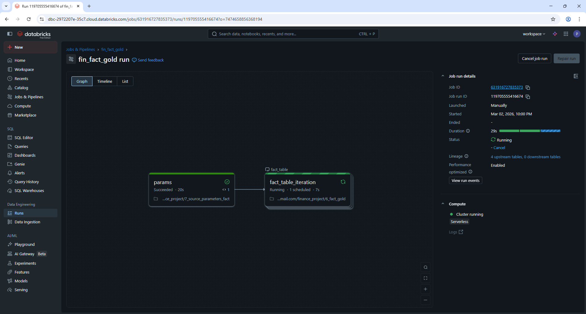
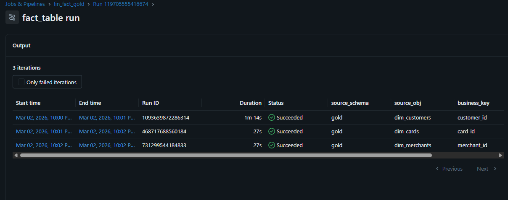
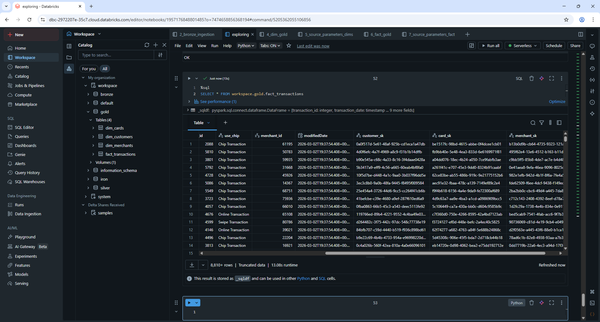

# Transaction Fact Table SCD / SK Assignment

## Table of Contents
1. [Introduction](#1-introduction)  
2. [Dependencies and widgets](#2-Dependencies-and-widgets)  
3. [Table initiation](#3-Table-initiation)  
4. [Inserting new transactions)](#4-Inserting-new-transactions))  
5. [Updating fact table with respective surrogate keys)](#5-Updating-fact-table-with-respective-surrogate-keys))  
6. [Fact table configuration for automated execution](#6-Fact-table-configuration-for-automated-execution)  
7. [Job test](#8-Job-test)

### 1. Introduction
This notebook is designed to create and maintain the fact_transactions table in the gold layer. It reads the raw transaction data from the silver layer, prepares it for the fact table, inserts it if the table does not exist, and populates foreign key surrogate keys (customer_sk, card_sk, merchant_sk) from the dimension tables. This ensures the fact table is ready for analytical queries and downstream reporting.



### 2. Dependencies and widgets
```python
from pyspark.sql.functions import *
from pyspark.sql.types import *
from delta.tables import DeltaTable
from pyspark.sql.window import Window

dbutils.widgets.text("source_schema", "")
dbutils.widgets.text("source_obj", "")
dbutils.widgets.text("business_key", "")
dbutils.widgets.text("sk_col", "")


source_schema = dbutils.widgets.get("source_schema")
source_obj = dbutils.widgets.get("source_obj")
business_key = dbutils.widgets.get("business_key")
sk_col = dbutils.widgets.get("sk_col")
```
The raw transactions data is loaded from the silver layer into a Spark DataFrame. Three new columns are added (customer_sk, card_sk, merchant_sk) to hold surrogate keys that link to the corresponding dimension tables. These columns are initially set to NULL and will be updated later once the dimension keys are mapped. This step prepares the data to become a fact table in the gold layer.
```python
df_fact = spark.table("workspace.silver.transactions_data")
silver_df = (
    df_fact.withColumn("customer_sk", lit(None).cast(StringType()))
    .withColumn("card_sk", lit(None).cast(StringType()))
    .withColumn("merchant_sk", lit(None).cast(StringType()))
)
```
If the fact table does not yet exist in the gold layer, this block performs the initial load by writing the prepared transactions DataFrame as a Delta table. The table is created with all necessary columns, including the surrogate key placeholders, making it ready for further processing.

### 3. Table initiation
```python
if not spark.catalog.tableExists("workspace.gold.fact_transactions"):
    print("Creating new transaction fact table in the gold schema")

    silver_df.write.format("delta")\
        .mode("overwrite")\
        .saveAsTable("workspace.gold.fact_transactions")

    print("Fact table created")
```
If the fact table already exists, the notebook performs a merge operation to insert any new transactions that are not already present. Existing rows are preserved, ensuring incremental updates are handled correctly. This allows the fact table to grow over time without overwriting historical data.

### 4. Inserting new transactions
```python
else:
    delta_fact = DeltaTable.forName(spark, "workspace.gold.fact_transactions")
    
    (
        delta_fact.alias("t").merge(
        silver_df.alias("s"),
        "t.transaction_id = s.transaction_id")
        .whenNotMatchedInsertAll()
        .execute()
    )

    print("New rows were inserted successfully")
```
The cell below reads the dimension table corresponding to the given business key, selecting only active rows and retrieving the surrogate key. These values will be used to populate the foreign key columns in the fact table. The filtering ensures that only the current version of each dimension record is used for the fact table relationships.

```python
source_table = f"{source_schema}.{source_obj}"
dim_table = ( spark.table(source_table)
    .filter(col("is_active") == True)
    .select(
        col(business_key), 
        col("surrogate_key").alias(sk_col)
        )
)
```

### 5. Updating fact table with respective surrogate keys
delta_target = DeltaTable.forName(spark,"workspace.gold.fact_transactions")

update_condition = f"t.{business_key} = s.{business_key} AND t.{sk_col} IS NULL"
set_update = {sk_col : f"s.{sk_col}"}
```python
(
    delta_target.alias("t").merge(
        dim_table.alias("s"),
        update_condition
    )
    .whenMatchedUpdate(
    set = set_update
    )
    .execute()
)
```
Finally, the fact table is updated to populate the surrogate key column. The merge operation matches each fact table row to the corresponding dimension row using the business key. Only rows where the surrogate key is currently NULL are updated. This ensures that all new transactions receive the correct dimension key references without altering existing data. After this step, the fact table is fully linked to its dimensions, ready for analytics.

### 6. Fact table configuration for automated execution
```python
fact_array = [
    {
        "source_schema" : "gold",
        "source_obj" : "dim_customers",
        "business_key" : "customer_id",
        "sk_col" : "customer_sk"
    },
    {
        "source_schema" : "gold",
        "source_obj" : "dim_cards",
        "business_key" : "card_id",
        "sk_col" : "card_sk"
    },
    {
        "source_schema" : "gold",
        "source_obj" : "dim_merchants",
        "business_key" : "merchant_id",
        "sk_col" : "merchant_sk"
    }
]
dbutils.jobs.taskValues.set(key = "output_key", value = fact_array)
```
This notebook defines a fact_array for mapping surrogate keys from dimension tables to the fact table. Each object in the array specifies the source dimension table in the gold layer, the business key used to identify records, and the corresponding surrogate key column that will populate the fact table. By structuring the configuration this way, the notebook can be automated to iterate over multiple dimensions, dynamically linking the fact table to its relevant dimension keys.

### 7. Job test

Job ran successfully.



Confirming it by querying the tables on notebook.



The notebook was executed successfully as part of the automated workflow. The fact_transactions table in the gold layer was created since it did not previously exist. In order to check how the else block performs when the autoloader loads the second batch [check here](../../Second%20Batch/README.md#gold-layer--fact-table). The surrogate key columns were populated from the corresponding active dimension tables, ensuring that the fact table is fully linked and ready for downstream analysis. 