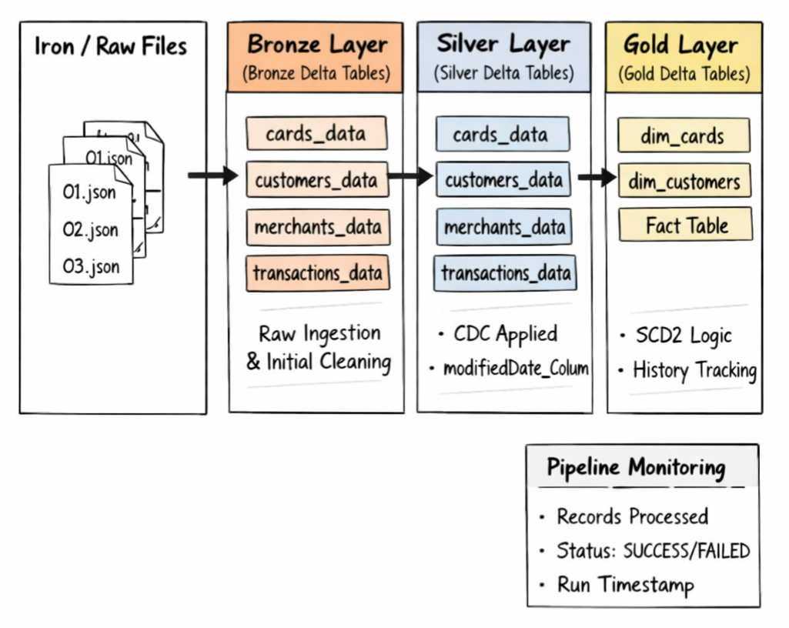

# Finance Project Data Pipeline

### Table of Contents

1. [Bronze Layer | Data Ingestion](First%20Batch/01_iron_to_bronze/README.md#bronze-layer--data-ingestion)
2. [Silver Layer | Data Refinement & Dimensional Modeling](First%20Batch/02_bronze_to_silver/README.md#silver-layer--data-refinement--dimensional-modeling)
3. [Gold Layer | SCD Type 2 Delta Lake Pipeline | Dimensions](First%20Batch/03_dim_silver_to_gold/README.md#gold-layer--scd-type-2-delta-lake-pipeline--dimensions)
4. [Transaction Fact Table | SCD / SK Assignment](First%20Batch/04_fact_silver_to_gold/README.md#transaction-fact-table--scd--sk-assignment)
5. [Second Batch](Second%20Batch/README.md#second-batch)
6. [Pipeline Monitoring Table](pipeline_monitoring_table/README.md#pipeline-monitoring-table)

This project implements a financial data pipeline designed to process and transform large scale transactional and master data into an analytically ready star schema. In the first step, raw JSON files were ingested, unnested, and some initial data types were casted, while intentionally leaving out certain complex string columns like "expires" in "mm/yy" format to be handled in the following layer.   

Some expensive operations, such as regex parsing on the transactions fact table with over 13 million rows, were performed to ensure proper normalization and quality. The dataset consists of three dimension tables and one fact table, with one dimension nested inside the fact table, which will be unnested in subsequent layers. The silver layer applies transformations and constraints for each table, including SCD1 and CDC on the dimension tables, ensuring no data duplication while keeping historical updates. The gold layer uses SCD2 on dimensions to tag expired data as is_active = false, while the fact table is append-only, receiving new records along with the surrogate keys of the dimension tables, preserving both historical and current state.
Above is a scheme of the the architecture I applied.