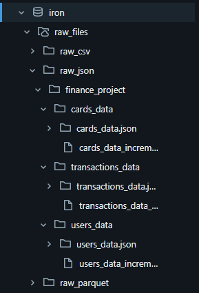
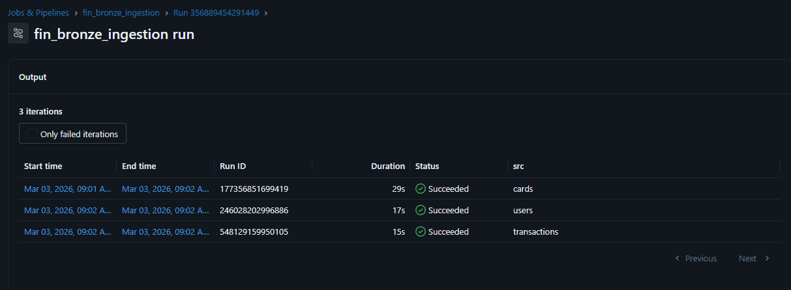
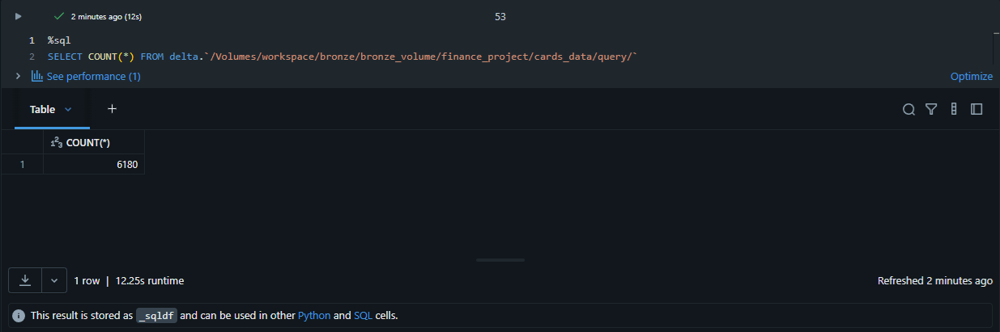
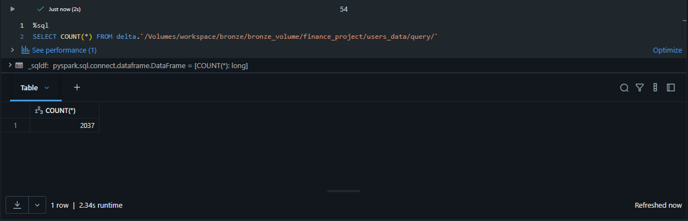
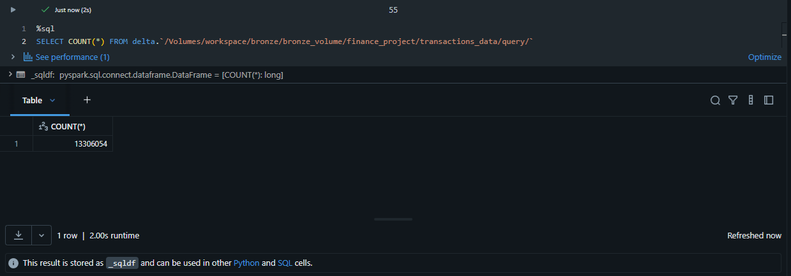
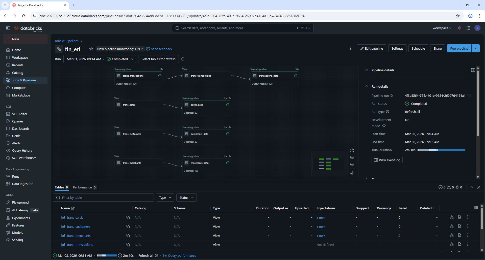
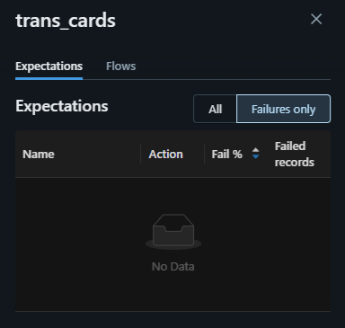
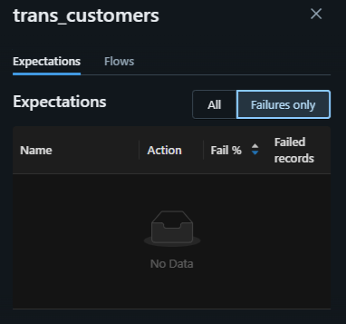
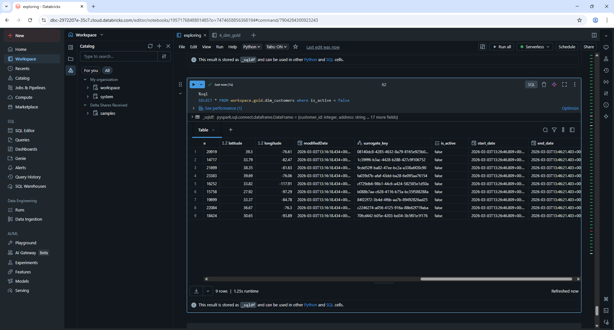
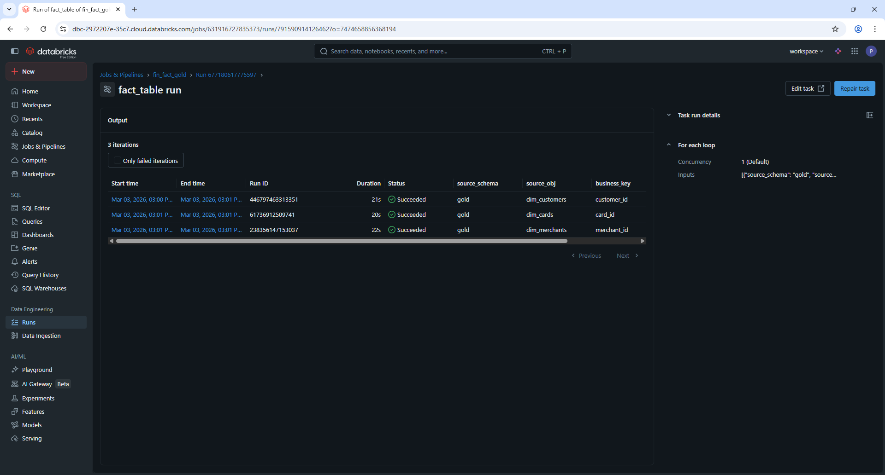

# Second Batch

In this section, I focus on ingesting the second source of data and studying the behavior of the pipeline as it handles this incremental update. The goal is to see how the tables evolve from Bronze to Silver and then to Gold, how the data ingestion and upsertion works, and how we keep track of pipeline runs at every stage.

### 1. Bronze Layer
About 20 minutes after the first initial batch, a second batch arrives. This batch is currently stored in the iron schema:

Ingestion pipeline ran successfully

I will confirm that the delta tables have been created by checking the catalog.

As expected:
- cards_data received 34 new records

- users_data received 37 new records

- transaction_data received 139 new records 

Ingestion in the bronze layer was successful.

### 2. Silver layer
In this layer we process the incoming data for each dimension table (cards, customers, and merchants) and the fact table. A new modifiedDate column is added to serve as the reference for CDC. The logic is mostly the same as in the first batch, except this time we get to see CDC in action, updating existing records where dimensions changed and inserting entirely new records.

ETL pipeline ran successfully

As expected, the fact table upserted 139 new records in the silver layer, the same number as in the bronze layer, because fact tables usually do not undergo SCD2 and just track history and all records.   
-cards_data upserted 20 new records, as opposed to 34 records in the bronze layer. The reason is that 14 records were updated and replaced with the new versions. Basically dimensions changed, or there could have been deduplication in data, or a primary key could have been null, but in this batch I can see clearly that cards_data didn’t have any rule breaks.

-customers_data upserted 20 new records as opposed to 37 in the bronze layer. The logic is similar: 17 records were replaced with updated versions due to dimension changes, not because of any constraint breaks or missing keys

### 3. Gold layer : Dimension tables
Here we perform SCD2. The target dimension tables already exist from the first batch, so now we can see the else: block in action. The existing records that changed in any dimension are set to is_active = false and end_date = current_timestamp(). Then the updated records are inserted as new records using the filter (col("surrogate_key").isNull())  to capture entirely new rows or those that caused the expiration of old ones.

Gold layer job ran successfully.

I will query the dimension gold tables andlets see how the tables have changed.

For dim_customers, 29 new rows were appended out of 37 total, 8 duplicates were automatically dropped. 9 records were dimensionally changed, which set their is_active to false, and 20 records were entirely new with new surrogate keys. Everything matches expectations.

### 4. Gold layer : Fact table
The fact table in Gold already existed from the first batch. After receiving new records, we filled the surrogate key values with the corresponding values from the Gold dimension tables.

Gold layer job ran successfully.

Lets query this table and see the result

Querying the fact table confirms that everything went as expected

Monitoring is really important for this batch. The pipeline_monitoring table tracks the number of records processed, the status of each table (SUCCESS/FAILED), and the timestamp of the run. This makes sure we can always see changes and quickly reference any issues if something fails. I also get ETL job alerts via email in case a pipeline fails, which helps me react fast.

This batch really highlighted how sensitive SCD2 and CDC logic can be. I noticed that if the CDC column isn’t properly updated, the merge won’t expire old records, even if everything else is correct. I initially applied deduplication for each streaming table in the ETL pipeline (dropDuplicated(["business_key"])), and removing it was a good call, otherwise it messed with some of the incremental updates. I also realized that changing <> to IS DISTINCT FROM is really useful, because it handles cases where some of the columns might have null values. Without it, nulls can silently break the update logic and cause the old records to never expire, so this small tweak makes the SCD2 merge much more reliable. Overall, small changes in logic or data can have a big impact, so it’s important to test carefully and keep track of every step.