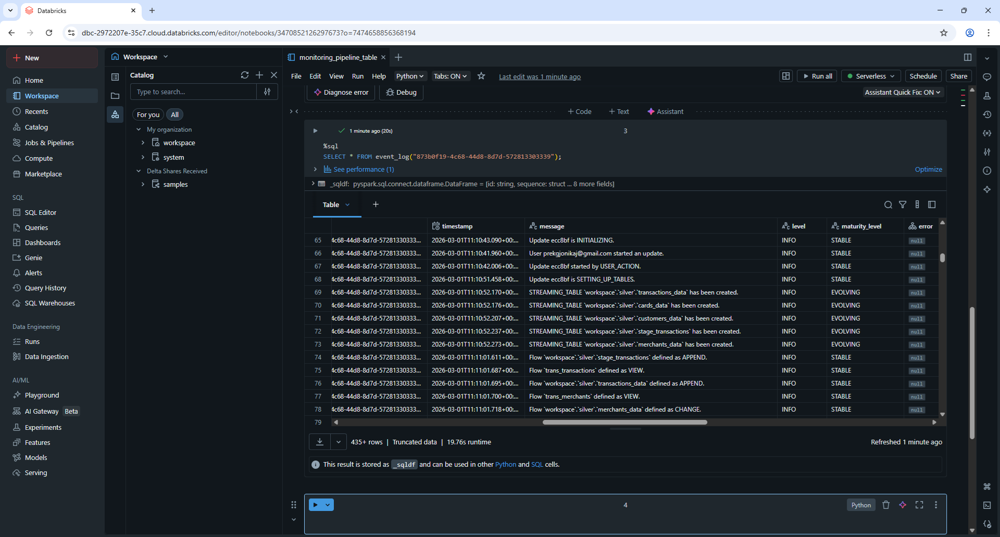
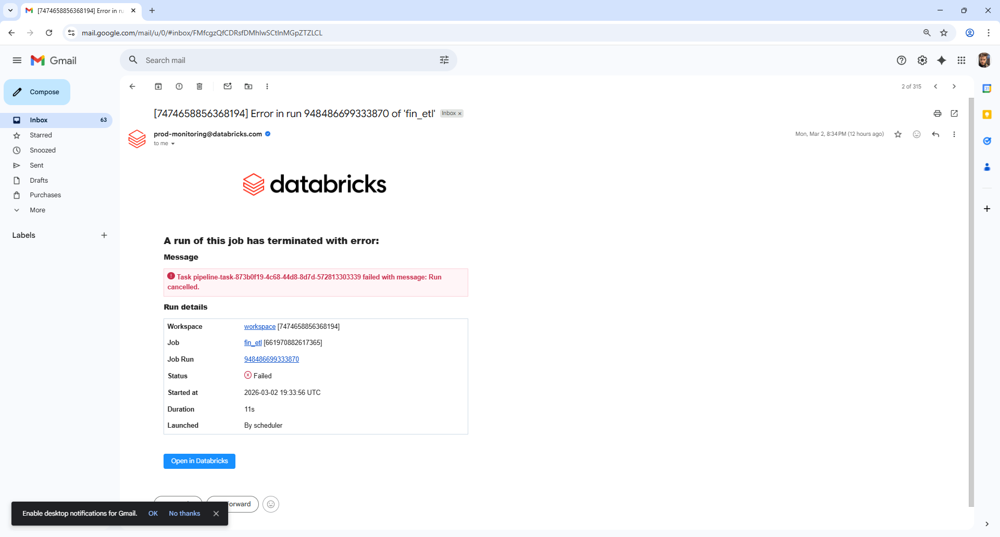

# Pipeline Monitoring Table

This notebook contains a SQL query for monitoring Databricks Lakehouse pipeline executions. It allows you to quickly review the recent activity of your ETL jobs over the last 7 days and provides important metadata for observability and debugging.
```sql
SELECT * FROM event_log("873b0f19-4c68-44d8-8d7d-572813303339");
```



- task_key is the unique key identifying the job task within the pipeline.
- job_id is the ID of the job in Databricks Jobs.
- run_id is the unique identifier for each run of the job.
- compute is the cluster or compute resource used for executing the job.
- period_start_time is the timestamp when the job started running.

This query is needed to track historical errors and pipeline runs so that if I need to reference a specific job or task later, I can quickly check it in my preferred dataframe. It basically lets me see what ran, when it ran, and which compute resources were used, all in one place.On top of that, I also receive ETL job alerts in my email whenever a pipeline fails, so I’m immediately aware of any issues.


